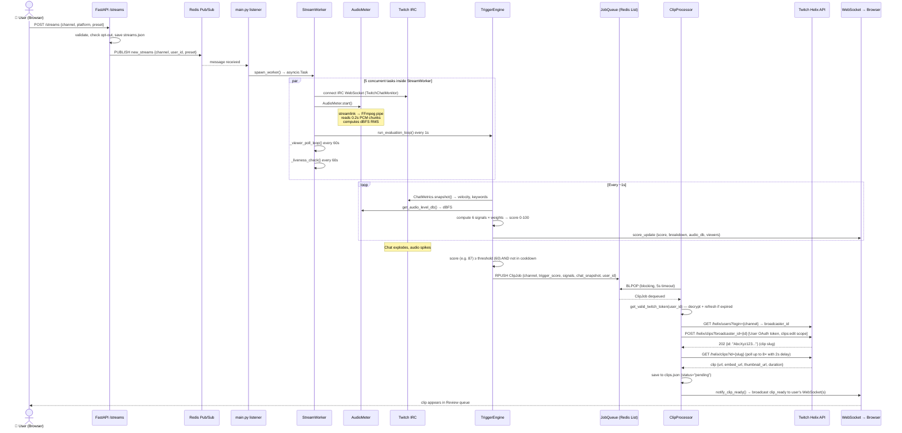
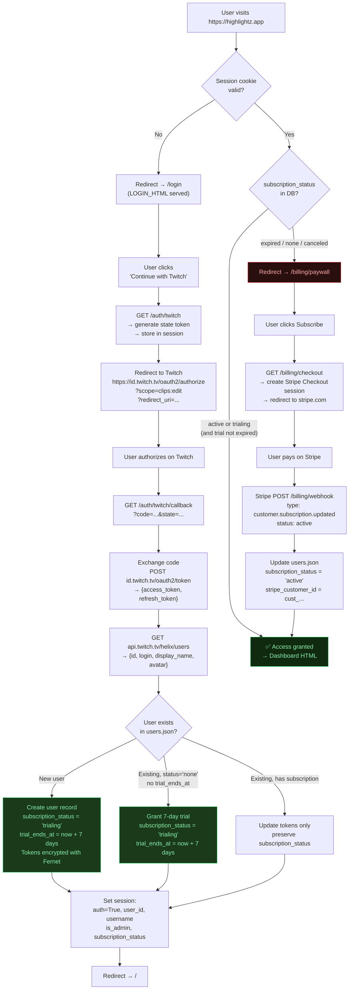
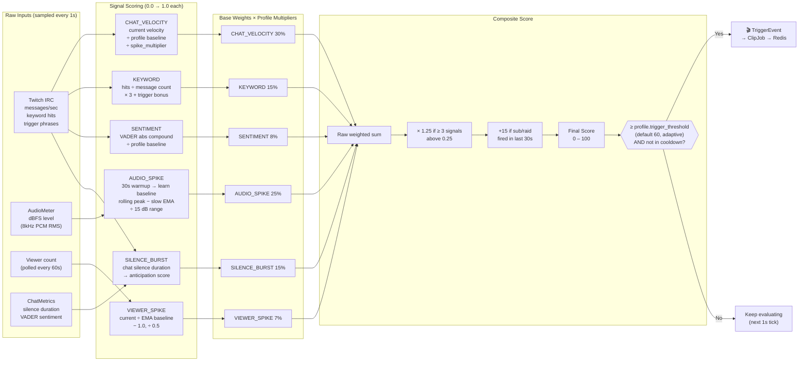
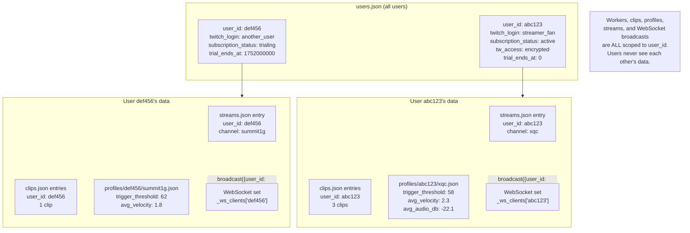

# Highlightz — Architecture Diagrams

---

## 1. System Overview — What Lives Where

```mermaid
flowchart TB
    subgraph BROWSER["🌐 User Browser"]
        UI["React SPA\n(Babel standalone, no bundler)\nDashboard · Clips · Streams · Settings\nFeedback · Account"]
        WSC["WebSocket Client\nreceives live score_update,\nclip_ready, stream_status"]
    end

    subgraph VPS["🖥️  VPS  —  /opt/highlightz  (systemd: highlightz.service, runs as root)"]
        direction TB

        subgraph PROC["Single Python Process  ·  asyncio event loop  ·  src/main.py"]

            subgraph STATIC_TASKS["4 Persistent background tasks (asyncio.gather)"]
                UV["Uvicorn / FastAPI\n0.0.0.0:8000\nsrc/dashboard/api.py"]
                RL["Redis Pub/Sub Listener\nsuperclipbot:new_streams\nsuperclipbot:remove_streams"]
                CP_LOOP["Clip Processor Loop\nrun_clip_processor()\nblocks on JobQueue.pop()"]
                AD["Auto-Delete Task\nruns daily\nremoves approved clips > 30 days"]
            end

            subgraph PER_STREAM["Per-Stream Worker  ·  1 StreamWorker per monitored channel  (max 20)"]
                direction LR
                SW["StreamWorker\n_run_session()"]
                subgraph WTASKS["5 concurrent tasks inside each worker"]
                    T1["_run_chat()\nTwitchChatMonitor IRC"]
                    T2["TriggerEngine\nrun_evaluation_loop()\nevery 1 second"]
                    T3["_profile_update_loop()\nevery 5s (learning)\n30s (calibrated)"]
                    T4["_liveness_check()\nevery 60s"]
                    T5["_viewer_poll_loop()\nevery 60s"]
                end
                AM["AudioMeter\nstreamlink subprocess\n  → FFmpeg subprocess\n  → Python RMS dBFS"]
                TE["TriggerEngine\n6 signals → composite score"]
                CM["ChatMetrics\n15s sliding window"]
                SP["StreamerProfile\nper-channel baselines\nadaptive threshold"]
            end

            subgraph CLIP_PIPELINE["Clip Pipeline"]
                CP["ClipProcessor\nprocess(ClipJob)\ntwitch_clips.create_clip()"]
            end

        end

        REDIS[("Redis :6379\n─────────────\nList: superclipbot:clip_jobs\nPub: superclipbot:new_streams\nPub: superclipbot:remove_streams")]

        subgraph FS["Local Filesystem  ·  ./clips/"]
            direction LR
            F1["streams.json\nclips.json\nusers.json\nusers.json.bak"]
            F2["feedback.json\noptout.json"]
            F3["profiles/\n  {user_id}/\n    {channel}.json"]
        end
    end

    subgraph EXT["☁️  External Services"]
        direction LR
        TH["Twitch Helix API\napi.twitch.tv/helix\n─────────────\n• /streams  (viewer count, title)\n• /users    (broadcaster ID)\n• /clips    (POST create, GET fetch)\n• /token    (client credentials)"]
        TO["Twitch OAuth2\nid.twitch.tv\n─────────────\n• /authorize  (consent screen)\n• /token      (code exchange)\n• /token      (refresh)"]
        TI["Twitch IRC Chat\nirc-ws.chat.twitch.tv:443\n─────────────\n• PRIVMSG  (chat messages)\n• USERNOTICE  (subs/raids)"]
        STR["Stripe\napi.stripe.com\n─────────────\n• checkout.sessions.create\n• billing_portal.sessions.create\n• subscriptions.list / cancel\n• Webhook: POST /billing/webhook"]
    end

    UI -- "HTTPS REST" --> UV
    WSC -- "WSS /ws" --> UV
    UV -- "broadcasts score/clip/status events" --> WSC
    UV -- "publish new/remove stream" --> REDIS
    RL -- "subscribe" --> REDIS
    RL -- "spawn_worker()" --> PER_STREAM
    CP_LOOP -- "BLPOP 5s timeout" --> REDIS
    TE -- "score ≥ threshold\nClipJob → RPUSH" --> REDIS
    CP_LOOP --> CP
    CP -- "create_clip(user_oauth_token, broadcaster_id)" --> TH
    CP -- "notify_clip_ready() → WS broadcast" --> UV

    SW --> AM
    SW --> TE
    SW --> CM
    SW --> SP
    CM -- "ChatSnapshot every 1s" --> TE
    AM -- "get_audio_level_db() every 1s" --> TE
    T5 -- "viewer_count" --> TE
    T4 -- "is_live?" --> TH
    T5 -- "get_stream_info()" --> TH
    T1 -- "IRC WebSocket" --> TI
    AM -- "stream URL" --> TH

    UV -- "OAuth flow" --> TO
    UV -- "checkout / webhook" --> STR
    STR -- "POST /billing/webhook" --> UV

    UV -- "read/write" --> FS
    T3 -- "save profile" --> F3
    SP -- "load/save JSON" --> F3
```

---

## 2. Clip Pipeline — End to End

---

## 3. Authentication & Session Flow

---

## 4. Signal Scoring — How a Trigger Score is Built

---

## 5. Per-User Data Isolation

